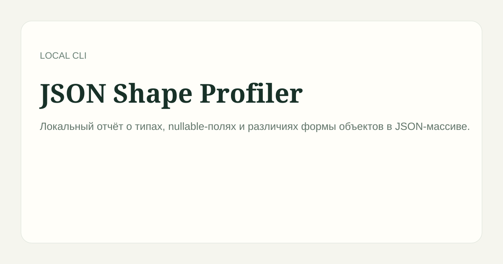

# JSON Shape Profiler

> Локальный отчёт о типах, nullable-полях и различиях формы объектов в JSON-массиве.

## Запуск

~~~bash
npm ci
node src/index.mjs examples/items.json --json profile.json
~~~

## Принцип работы

Инструмент работает только с указанными локальными файлами или репозиториями, не отправляет данные во внешние сервисы и создаёт отчёт отдельно от исходных данных.

В JSON-отчёте указаны число объектов, схема корневого значения и объектов массива, обязательные поля, nullable-поля, количество пропусков и частотное распределение типов для каждого поля.

## Проверка

~~~bash
npm test
npm run check
~~~

## Лицензия

MIT.
